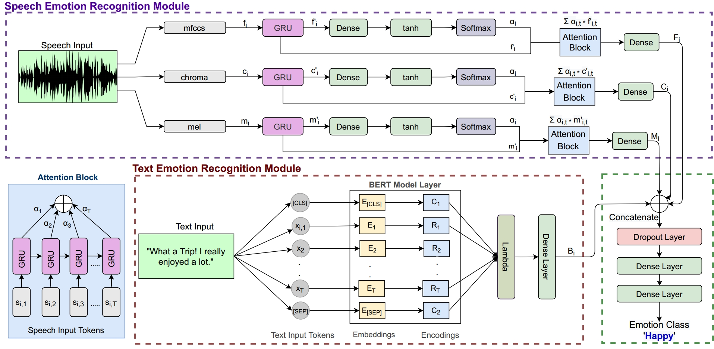

Towards the Explainability of Multimodal Speech Emotion Recognition
===================================================================

Implementation for the paper (Interspeech 2021). The paper has been accepted, its full-text will be shared after publication.<br>
**[Towards the Explainability of Multimodal Speech Emotion Recognition][1]**<br>
[Puneet Kumar](https://puneet-kr.github.io/), Vishesh Kaushik, and [Balasubramanian Raman](http://faculty.iitr.ac.in/~balarfma/)  

<!---->


<!---
If you use this code in your published research, please consider citing:
```text
@inproceedings{}
```
--->

Setup and Dependencies
----------------------
1. Install Anaconda or Miniconda distribution and create a conda environment with **Python 3.6+**.
2. Install the requirements using the following command:
```sh
pip install -r Requirements.txt
```
3. Download [glove.6B.zip][2], unzip and keep in `glove.6B` folder.
4. Download the required datasets.

Steps to run the Code
---------------------
1. **For IEMOCAP Dataset**:<br>
Run `Data_Preprocess(IEMOCAP).ipynb` in Jupyter Notebook, then <br>
Run `Training(IEMOCAP).ipynb` in Jupyter Notebook, then <br>
Run `Analysis(IEMOCAP).ipynb` in Jupyter Notebook.<br>
OR<br> 
Run `main_IEMOCAP.py` in the terminal/command-line using the following command:
```sh
python main_IEMOCAP.py --epoch=100
```
2. **For MSP-IMPROV Dataset**:<br>
Run `Data_Preprocess(IMPROV).ipynb` in Jupyter Notebook, then <br>
Run `Training(IMPROV).ipynb` in Jupyter Notebook, then <br>
Run `Analysis(IMPROV).ipynb` in Jupyter Notebook.<br>
OR<br> 
Run `main_IMPROV.py` in the terminal/command-line using the following command:
```sh
python main_IMPROV.py --epoch=100
```
3. **For RAVDESS Dataset**:<br>
Run `Data_Preprocess(RAVDESS).ipynb` in Jupyter Notebook, then<br>
Run `Training(RAVDESS).ipynb` in Jupyter Notebook, then <br>
Run `Analysis(RAVDESS).ipynb` in Jupyter Notebook.<br>
OR<br> 
Run `main_RAVDESS.py` in the terminal/command-line using the following command:
```sh
python main_RAVDESS.py --epoch=100
```

### Saving Model Checkpoints  
By default, the code saves the model checkpoints in the `log-1` folder. 

### Tensorboard Logging
The tensorboard log files are saved in the `log-1` folder. These files can be accessed using the following command:
```sh
tensorboard --logdir "/log-1"
```

[1]: https://www.interspeech2021.org/
[2]: https://nlp.stanford.edu/projects/glove/
[2]: http://www.t4sa.it/
